# Підключення датчиків різного типу

Існують різні типи сенсорів, кожен з яких в свою чергу підключається по різному. На основній платі приладу присутні перемикачі (рис.1).

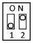 Схематичне зображення перемикача - Рисунок 1.

Вони потрібні для зміни типу підключення того, чи іншого типу сенсора. Є PNP та NPN сенсори (рис.2).

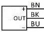 Схематичне зображення PNP та NPN сенсора - Рисунок 2.

Кожен може мати зовнішнє джерело живлення, отже він не потребує живлення від приладу. Також можна підключитися до прямого сигналу від самого обладнання або через інші перемикачі / реле.

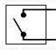 Схематичне зображення реле - Рисунок 3.

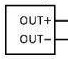 Схематичне зображення сенсора прямого сигналу - Рисунок 4.

## 1. PNP та NPN датчики

Для підключення сенсорів такого типу потрібно встановити перемикачі в задане положення, підключити живлення `(+24В, GND)` і  сигнал `(SIG+/SIG– в залежності від типу сенсора)`. Схема підключення, та положення перемикачів зображено на рисунку 5, а також під кришкою приладу.

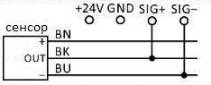 Підключення PNP сенсора

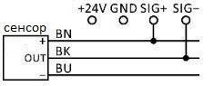 Підключення NPN сенсора

## 2. PNP та NPN датчики з зовнішнім джерелом живлення

Для даного типу сенсорів потрібно встановити перемикачі в задане положення, а також підключити сигнал `(SIG+, SIG-)` до відповідних виходів на сенсорі. Схема підключення, та положення перемикачів для різних типів сенсорів показано на рисунку 5, а також під кришкою приладу.

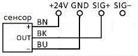 Підключення PNP сенсора з зовнішнім живленням

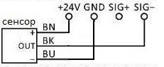 Підключення NPN сенсора з зовнішнім живленням 

## 3. Прямий сигнал від обладнання та реле

Є сенсори які живляться від мережі 220 В, на пряму до приладу вони не підключаються. Їх можна підключити за допомогою `реле`. Для такого підключення потрібно встановити перемикачі в задане положення та підключити  виходи з реле до `GND` і `SIG-`. В деякому обладнанні можна отримувати  інформацію безпосередньо від  `схеми управління обладнанням` без допомоги зовнішніх сенсорів. Для такого типу підключення потрібно встановити перемикачі в задане положення та підключити `SIG+` і `SIG-`. Схема підключення, та положення перемикачів для різних типів сенсорів показано на рисунку 5, а також під кришкою приладу.

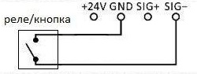 Підключення реле

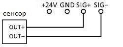 Підключення від схеми управління

## 4. Схеми та положення перемикачаів для підключення сенсорів різного типу

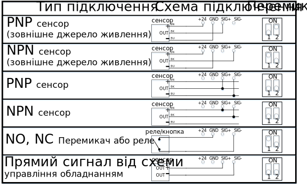

Схематичне зображення схем та положення перемикачів - Рисунок 5. 
