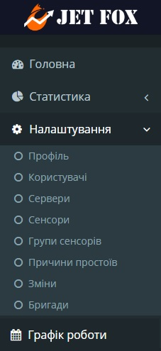

# Налаштування

З ліва є меню сайту, на якому можна побачити різні пункти (рис.1). Вибравши "Налаштування", можна побачити деклька вкладок, а саме: профіль, користувачі, сервери, сенсори, групи сенсорів, причини простою, зміни, бригади.

Меню сайту - Рисунок 1.

Детальніше про кожну вкладу нижче.

## Профіль

Після вибору вкладки "Пофіль", можна побачити поле з написом "Пароль" і кнопку "Змінити" (рис.2).

Вкладка "Профіль" - Рисунок 2.

Натиснувши на кнопку "Змінити", відбудеться перенаправлення на сторінку з зміною паролю даного користувача (рис.3).

 Вкладка зміни паролю - Рисунок 3.

Щоб змінити пароль користувача, потрібно в полі "Поточний пароль" ввести пароль який дійсний на даний момент. Після чого в полі "Новий пароль", потрібно ввести новий пароль, який відрізняється від попереднього. А далі в полі нижче, підтвердити його ввівши його повторно і натиснути кнопку "Змінити".

## Користувачі

Після вибору вкладки "Користувачі", можна побачити всіх користувачів, які закріплені за даним підприємством (рис.4).

Вкладка "Користувачі" - Рисунок 4.

Як можна побачити, в даній вкладці можна добавляти нових користувачів натиснувши на "+" в верхньому правому куті (рис.4). Далі з'явиться вікно (рис.5), в якому потрібно ввести дані нового користувача, такі як:
- номер телефона
- ПІБ

Обов'язкові поля для введення відзначено " * "
Якщо користувачу потрібно права, які дозволяють добавляти нових користувачів, зміна назв сенсорів, об'єднання сенсорів в групи, строрення бригад, створення змін - потрібно поставити галочку напроти пункта "admin".

Також там є два поля "Початок" і "Кінець", в яких вводяться рамки часу, для відправки смс каристувачу з правами admin. В смс приходить повідомлення з початком простою. Тобто, якщо з'явився простій по якість причині, то адміну прийде повідомлення про це.

 Вкладка "Користувачі" - Рисунок 5.

Також в вкладці "Користувачі" є кнопка "Змінити пароль" (рис.4). Вона потрібна для того, щоб скинути існуючий пароль певного користувача (наприклад, якщо користувач забув свій пароль). Потрібно прости натиснути на кнопку, після чого вибраному користувачеві прийде новий пароль для входу.

Натиснувши на кнопку "Редагувати" в вкладці "Користувачі" на певного користувача, відкриється вікнок з інформацією про нього (рис.6). Це потрібно для того, якщо дані користувача невірні і потрібно внести в них зміни.

Вікно зміни інформації про користувача - Рисунок 6.

Також, можна видалити любого з вибраних користувачів, натиснувши на кнопку "Видалити" (рис.4).

## Сервери

Вибравши дану вкладку, можна побачити всі створенні сервери для кожної "коробки". Натиснувши на кнопку "Редагувати" (рис.7), відкриється вікно, в якому можна змінити назву тієї чи іншої "коробки", для подальшого комфортного користування (рис.8).

Вкладка "Сервери" - Рисунок 7.

 Вкладка зміни назви сервера-"коробки" - Рисунок 8.

`** Примітка  в полі "Хард Ид" категорично заборонено вносити будь-які зміни!`

## Сенсори

В даній вкладці відображаються всі сенсори від усіх "коробок". Тут можна об'єднати деякі сенсори в групи, натиснувши на поле біля сенсора (рис.9). Детальніше про створення груп сенсорів нижче.

Після натиснення на кнопку "Редагувати" навпроти обраного сенсора, відкрється вікно з можливістю зміни імені сенсора, для подальшого комфортного користування (рис.10). 

 Вкладка "Сенсори" - Рисунок 9.

Вікно зміни назви сенсора - Рисунок 10.

`** Примітка  в полі "Хард Ид" категорично заборонено вносити будь-які зміни!`

Також вданому вікні присутнідва поля: простій і коефіцієнт.

- В полі простій ставиться мінімальний час в хвилинах, після якого розпочнеться рахунок простою (при введені в поле значення "5", простій почне рахувтися після надходження на сервер п'яти нульових значень).

- В полі коефіцієнт ставиться число, на яке будуть множиться кількість спрацювань сенсора (наприклад прес видавлює п'ять одиниць продукту, одне спрацювання сенсора дорівнює п'яти одиць продукту, в такому випадку в полі "коефіцієнт" потрібно вказати "5").

## Групи сенсорів

Вданій вкладці можна створювати групи сенсорів. Це потрібно для об'єнання декількох датчиків у вкладці "Сенсори". Натиснувши на "+" з'явиться поле для введення назви групи, після введення назви, потрібно натиснути на кнопку "Зберегти".

Також можна змінити назви існуючих груп, для цього потрібно лише натиснути на кнопку "Редагувати" (рис.11). також можна видалити одну із груп натиснувши на кнопку "Видалити".

Вкладка "Групи сенсорів" - Рисунок 11.

## Причина простоїв

Вибравши дану вкладку можна створювати причини простої для тих чи інших ситуацій, за яких можуть виникнути простої (рис.12). Натисшувши на кнопку "+" з'явиться вікно (рис.13) в якому потрібно ввести назаву причини простою і натиснути на кнопку "Зберегти".

Також можна відредагувати назву вже створених причини, для цього потрібно натиснути на кнопку "Редагувати" (рис.12).

 Вкладка "Причини простою" - Рисунок 12.

Вікно створення причини простою - Рисунок 13.

## Зміни

В даній вкладці можна створювати зміни для подальшого створення графіку роботи (детальніше про [графік роботи](https://medakadem.github.io/JetFox/JetFox_Box/scheduler), натисніть на силку).

Для створення нової змінити потрібно натиснути на кнопку "+" (рис.14). Після чого з'явиться нове поле де потрібно ввести ім'я зміни, також потрібно вибрати колір, який буде відображати дану зміну на графіку. Для цього потрібно натиснути на кнопку з трикутником рис.15). З'явиться вибір кольору, в кому можна вибрати колір і його відтінок. Вибравши колір, потрібно натиснути кнопку "ок". Після всіх вище перерахованих дій, потрібно натиснути на кнопку збереження (рис.15).

Також можна відредагувати існуючі зміни, для цього потрібно лише натиснути на одну із змін, після чого можна змінити назву і колір цієї змінити, виконавши тіж дії, що і вище (рис.14).

Вкладка "Зміни" - Рисунок 14.

Вкладка "Зміни" (створення нової зміни) - Рисунок 15.

## Бригади

В даній вкладці можна створювати бригади для подальшого створення графіку роботи (детальніше про [графік роботи](https://medakadem.github.io/JetFox/JetFox_Box/scheduler), натисніть на силку).

Щоб створити нову бригаду потрібно лише натиснути на кнопку "+". З'явиться поле, де потрібно написати назву бригади, після чого потрібно натиснути на кнопку "Зберегти" (рис.16).

Також можна відредагувати існуючі бригади, для цього потрібно лише натиснути на одну із бригад і ввести нове ім'я.

Вкладка "Бригади" - Рисунок 16.