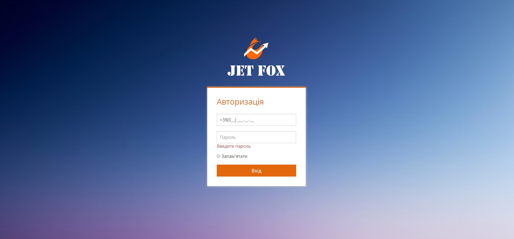

# Авторизація

Вхід на сайт JetFox здійснюється за допомогою унікального логіна і паролю.

Після створення користувача, на вказаний номер телефона надходить повідомлення з одноразовим паролем для входу та посиланням на сайт.

Після переходу за посиланням, відкривається сторінка авторизації (рис.1)

Авторизація на сайті - Рисунок 1.

Для авторизації необхідно ввести власний номер телефону, а також одноразовий пароль з повідомлення і натиснути кнопку Вхід. Після цього здійснюється переадресація на сторінку для створення постійного паролю. 

Примітка:  допустимими символами є: 

- Літери нижнього регістру {a-z}
- Літери верхнього регістру {A-Z}
- Цифри {0-9}