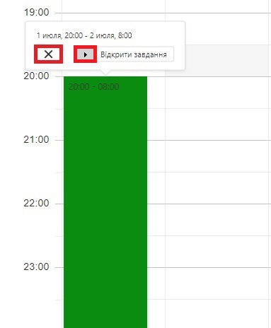

# Графік роботи

З ліва є меню сайту, на якому можна побачити різні пункти (рис.1). Вибравши "Графік роботи", з'явиться поле для створення графіка роботи (рис.2).

Меню сайту - Рисунок 1.

Щоб створити графік роботи, потрібно натистуну два рази лівою кнопкою миші в будь-якому пустому місці на полі (рис.2).

Поле для створення графіка роботи - Рисунок 2.

З'явиться вікно для налаштування графіку. Щоб налаштувати графік роботи, потрібно:

-  Вибрати зміну яка буде працювати (рис.3);
-  Встановити час і дату початку роботи зміни (після внесення часу і дати, потрібно натиснути кнопку "Готово" - рисунок 4);
-  Встановити час і дату кінця роботи зміни (якщо зміна працює в ночі і до ранку, потрібно вибрати наступний день. Після внесення часу і дати, потрібно натиснути кнопку "Готово" - рисунок 5);
-  По закінченню налаштувань, для завершення створення графіку і збереження внесених даних, потрібно натиснути кнопку "Готово" (рис.6).

Вибір зміни - Рисунок 3.

Встановлення дати і часу початку роботи зміни - Рисунок 4.

Встановлення дати і часу кінця роботи зміни - Рисунок 5.

Завершення створення графіку - Рисунок 6.

Після створення графіку роботи, його можна побачити в виглялі стовпця в полі загального графіка. Для продовження налаштування графіку, потрібно натиснути лівою кнопкою миші на сам графік. З'явиться контекстне меню (рис.7), в якому можна видалити графік (натиснувши на "х"), або редагувати (натиснувши "Відкрити завдання").

Натиснувши кнопку "Відкрити завдання", з'явиться вже знайоме вікно створення графіку роботи. В полі "Бригади" будуть відображені всі наявні бригади. До бригад потрібно прив'язати групу сенсорів з якими вони працюють (рис.8).

Вибравши групу сенсорів, навпроти назви бригади з'явиться значок, натиснувши на який, можна побачити незадіяних користувачів і користувачів, які знаходятся в цій бригаді (рис.9). Тут можна добавити нових або видалити вже існуючих користувачів в бригаді.

Після завершення редагування, потрібно натиснути на кнопку "Готово"

Редагування і видалення графіку - Рисунок 7.

Прив'язка груп сенсорів до бригад - Рисунок 8.

Завершення редагування - Рисунок 9.

Якщо все налаштовано в графіку роботи і графік не змінюється на протязі тижня/місяця, то можна його продовжити на цей період автоватично. Для цього потрібно натиснути правою кнопкою миші на вибраний графік, після чого з'явиться контекстне меню з можливістю продовжити його на тиждень або місяць.

Продовження графіку на тиждень/місяць - Рисунок 10.