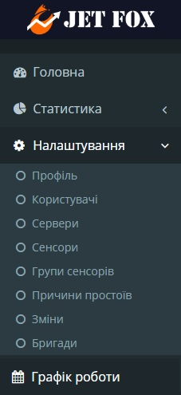
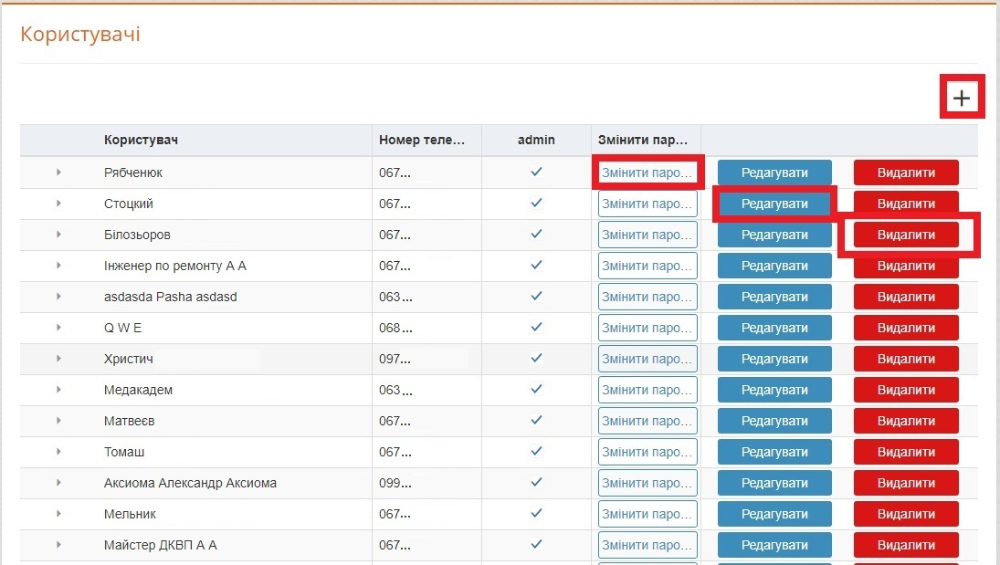
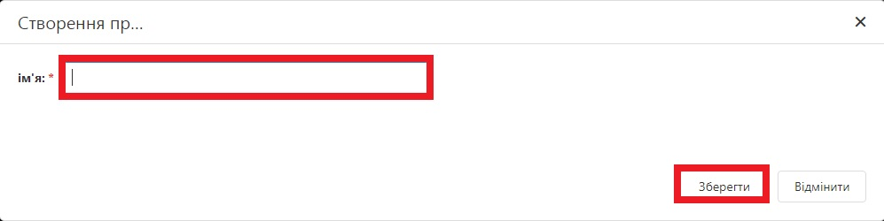

# Налаштування

Зліва розташоване меню, до складу якого входить розділ "Налаштування". В розділі доступні: профіль, користувачі, сервери, сенсори, групи сенсорів, причини простою, зміни, бригади.

Меню сайту - Рисунок 1.

## Профіль

Для зміни паролю необхідно натиснути кнопку "Змінити" (рис. 2).

Вкладка "Профіль" - Рисунок 2.

В результаті здійснюється переадресація на сторінку зміни паролю даного користувача (рис. 3).

 Вкладка зміни паролю - Рисунок 3.

Для зміни паролю користувача, необхідно ввести поточний пароль, новий пароль (який відрізняється від поточного) та підтвердження нового паролю.

## Користувачі

Зовнішній вигляд переліку користувачів наведений на рисунку 4.

Перелік користувачів - Рисунок 4.

Для додавання нового користувача необхідно натиснути на "+" в правому верхньому куті екрану (рис.4), та ввести дані нового користувача.

У вікні введення даних користувача обов'язкові поля для відзначені зірочкою "*". У разі необхідності у наданні користувачу адміністративних прав (створення нових користувачів, змін назв сенсорів, об'єднання сенсорів в групи, створення бригад і змін), потрібно встановити користувачу галочку "admin".

Поля "Початок" і "Кінець" задають інтервал часу, на протязі якого система буде відправляти повідомлення про простої на телефон користувача.

Вікно створення нового користувача - Рисунок 5.

В переліку користувачів також доступні функції зміни пароля, редагування даних або видалення користувача із системи.

## Сервери

Зовнішній вигляд переліку блоків збирання даних, що підключені до системи, наведений на рисунку 6. Для редагування даних певного блоку необхідно натиснути кнопку "Редагувати" (рис.6), та змінити назву блоку (рис.7)

Перелік блоків збирання даних - Рисунок 6.

 Вікно зміни назви блоку збирання даних - Рисунок 7.

`Важливо: категорично заборонено вносити будь-які зміни в полі "Хард Ид"!`

## Сенсори

Зовнішній вигляд переліку всіх сенсорів, підключених до всіх блоків збирання даних, наведений на рисунку 8. При необхідності сенсори можна об'єднувати в групи шляхом призначення групи певному сенсору.

Кнопка "Редагування" дозволяє змінити ім'я сенсору, нормативний час простою та коефіцієнт кратності (рис.9).

 Перелік сенсорів - Рисунок 8.

Вікно редагування даних по певному сенсору - Рисунок 9.

Значення в полі простій являє собою час в хвилинах, після закінчення якого система розпочинає відлік простою по даному сенсору. Наприклад, при введенні в це поля поле значення "5", система розпочне відлік простою через 5 хвилин після надходження останнього ненульового значення.

Значення в полі коефіцієнт являє собою кількість одиниць продукції, які оброблюються за один такт роботи машини. Наприклад, якщо за один такт прес виготовляє 5 заготовок плитки, то коефіцієнт кратності дорівнює 5.

`Важливо: категорично заборонено вносити будь-які зміни в полі "Хард Ид"!`

## Групи сенсорів

Зовнішній вигляд переліку груп сенсорів, підключених до всіх блоків збирання даних, наведений на рисунку 10.

Для додавання нової групи сенсорів необхідно натиснути на "+" в правому верхньому куті екрану, та ввести дані нової групи.

В переліку груп сенсорів також доступні функції редагування даних або видалення групи із системи, а також додавання сенсорів в групи.

Перелік груп сенсорів - Рисунок 10.

Щоб дабавити сенсори в створені групи, необхідно натиснути на ім'я групи і вибрати потрібні сенсори натискаючи "+" біля його назви. Щоб видалити сенсор з групи, достатньо натиснути на "х" біля його імені (рис.10).

## Причини простоїв

Зовнішній вигляд переліку причин простоїв наведений на рисунку 11.

Для додавання нової причини простоїв необхідно натиснути на "+" в правому верхньому куті екрану, та ввести дані нової причини простоїв.

В переліку причин простоїв також доступні функції редагування даних або видалення причин простоїв із системи.

 Перелік причин простою - Рисунок 11.

Вікно створення причини простою - Рисунок 12.

## Зміни

Графік роботи виробництва зазвичай має змінний характер. Зовнішній вигляд переліку змін наведений на рисунку 13, а загальна інформація про використання змінно-бригадного графіку роботи доступна за [посиланням](https://medakadem.github.io/JetFox/JetFox_Box/site_information/scheduler).

Для додавання нової зміни необхідно натиснути на "+" в правому верхньому куті екрану, та ввести дані нової зміни, а саме назву зміни та її колір відображення на графіках. 

В переліку змін також доступна функція видалення змін із системи.

По завершенні процесу створення або редагування змін необхідно натиснути кнопку збереження даних.

Вкладка "Зміни" - Рисунок 13.

## Бригади

Виробничий процес зазвичай має бригадний характер. Зовнішній вигляд переліку бригад наведений на рисунку 14, а загальна інформація про використання змінно-бригадного графіку роботи доступна за [посиланням](https://medakadem.github.io/JetFox/JetFox_Box/site_information/scheduler).

Для додавання нової бригади необхідно натиснути на "+" в правому верхньому куті екрану, та ввести дані нової бригади.

В переліку бригад також доступні функції редагування даних або видалення бригад із системи, а також додавання користувачів в бригади.

Вкладка "Бригади" - Рисунок 14.

Щоб дабавити користувачів в створені бригади, необхідно натиснути на ім'я бригади і вибрати потрібних користувачів натискаючи "+" біля їх імені. Щоб видалити користувача з бригади, достатньо натиснути на "х" біля його імені (рис.14).