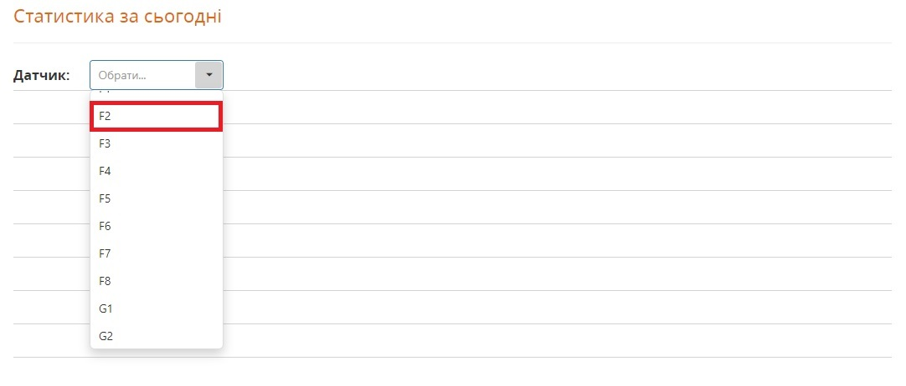
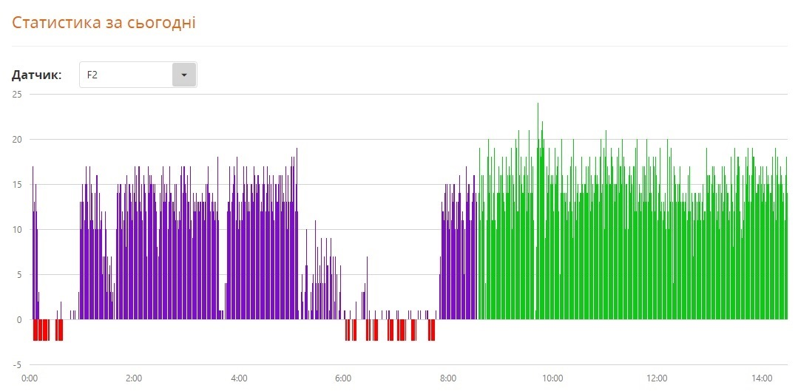
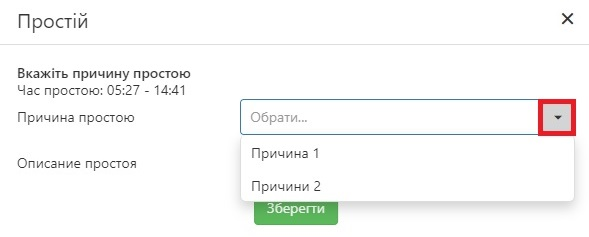
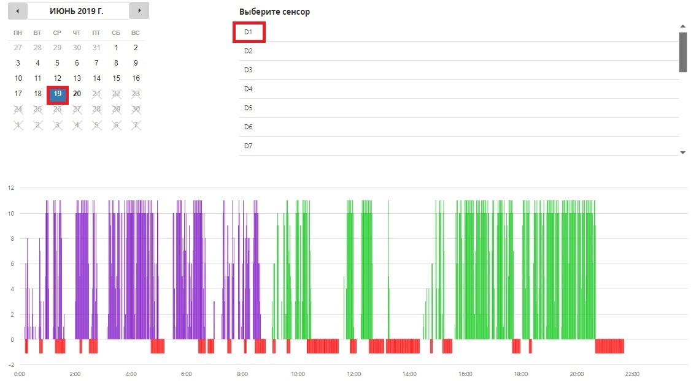
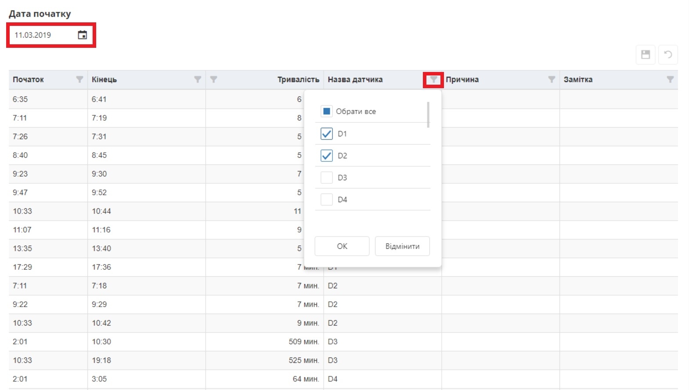

# Статистика

З ліва є меню сайту, на якому можна побачити різні пункти (рис.1). Вибравши "Статистика", можна побачити деклька вкладок, а саме: статистика за сьогодні, статистика за проміжок часу, статистика по сенсору, статистика простоїв.

 Меню сайту - Рисунок 1.

Детальніше про кожну вкладу нижче.

## Статистика за сьогодні

В даній вкладі потрібно обрати датчик із спливаючого списку, який цікавить, наприклад F2 (рис.2).

Статистика за сьогодні - Рисунок 2.

Пілся чого зявиться графік по даному датчику за поточний день (рис.3).

Графік по датчику за поточний день - Рисунок 3.

На графіку можна описати причину просто (простій зображений червоним кольором), для цього потрібно натиснути на сам простій, після чого з'явиться вікно для опису (рис.4).

Вікно опису причини простою - Рисунок 4.

Для вибору причини простою, потрібно натиснути на спливаючий список і вибрати необхідну причину. Для детальнішого опису простю слугує поле нижче.

## Статистика по сенсору

В даній вкладці можна обрати любий день і датчик, який цікавить, щоб побачити його статистику (рис.5). Тут також можна описати причину простою натиснувши на нього (рис.4).

Графік по датчику за вибраний день - Рисунок 5.

## Простої

В даній вкладці можна побачити всі простої за вибраний день. Натиснувши на "календар" (рис.6), можна обрати любий день, який цікавить, щоб побачити простої.

В таблиці відображається початок, кінець, тривалість простою, по кожному датчику.

Натиснувши на фільтр, можна обрати конкретиний датчик або датчики, які цікавлять.

Простої за вибраний день - Рисунок 6.